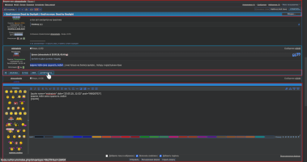
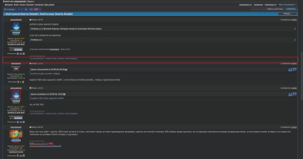
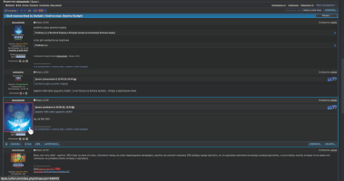
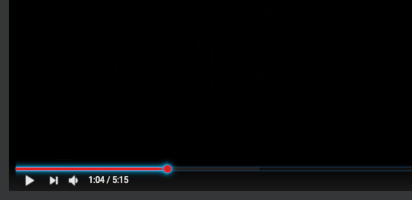
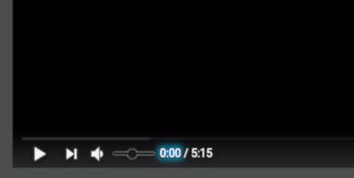
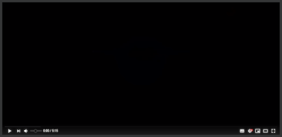
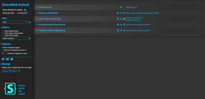
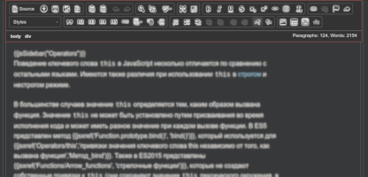
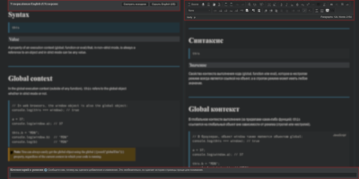

### about
this is the repo of my userstyles.

#### license  

<!-- #### wiki -->

#### platform
  
  
  

#### external repos
  
  

### list of styles 
#### [ 4pda.ru Forum Tweaks](https://github.com/almaceleste/userstyles/raw/master/src/4pda.ru_Forum_Tweaks.user.css 'install')  
    
makes the forum more compact, convenient and interactive. this style does not change the background, buttons and other parameters of the site’s appearance, only functionality, so that it can be used in conjunction with other custom styles.  
* the site header is sticky now so you have access to important links all the time
* a quick reply box is docked at the bottom so you can scroll through messages, embed quotes from them and edit your answer at the same time
* the topic messages have a compacted view now: the margins are minimized and the message buttons are hidden until you hover your mouse over the message
* the user avatar is smaller now to make the message more compact - but it will become larger when you hover over it
* some other elements are more interactive
* use the settings menu to change the highlight color and other options on your choice.  

#### [ Youtube Progress Bar Highlighting](https://github.com/almaceleste/userstyles/raw/master/src/Youtube_Progress_Bar_Highlighting.user.css 'install')  
  
highlights the progress bar of the youtube player on hover  
* use the settings menu to change the highlight color on your choice.  

#### [ Youtube Controls Highlighting](https://github.com/almaceleste/userstyles/raw/master/src/Youtube_Controls_Highlighting.user.css 'install')  
  
highlights the controls of the youtube player to the preferred color on hover  
* use the settings menu to change the highlight color on your choice.  

#### [ Youtube Bottom Gray Shadow](https://github.com/almaceleste/userstyles/raw/master/src/Youtube_Bottom_Gray_Shadow.user.css 'install')  
  
changes a white shadow background of the Youtube Player's bottom to the gray color and adds some additional shadows to the bottom controls to increase readability  
* use the settings menu to change the shadow color on your choice.  

#### [ Stylus Theme (Dark Side)](https://github.com/almaceleste/userstyles/raw/master/src/Stylus_Theme_(Dark_Side).user.css 'install')  
')  
this style is a remastered and improved style from the Stylus Theme (Dark).
muchas gracias for Randy W. Sims, an author of it, for his huge work, which help us to save our eyes from the ruinous light.  
*'Come to the Dark Side' - Darth Vader*  
this style goes well with the darcula theme of the editor, imho.
but feel free with your own experiments.
* use the settings menu to change the highlight color on your choice.  

#### [ MDN Editor (Gray Toolbox)](https://github.com/almaceleste/userstyles/raw/master/src/MDN_Editor_(Gray_Toolbox).user.css 'install')  
')  
paints the MDN Editor's right and left toolboxes and the comment tool to the gray color.  
* use the settings menu to change the background and foreground colors on your choice.  

#### [ MDN Editor (UI Tweaks)](https://github.com/almaceleste/userstyles/raw/master/src/MDN_Editor_(UI_Tweaks).user.css 'install')  
')  
tweaks for the UI of the MDN Editor.  
* the left panel with the `Source` and `Hide` buttons is changed to position sticky to prevent sliding above
* the comment section is changed to be more compact and position absolute thus you could fill it while you edit the article
* so the useful things are always at hand
* source area settings: background color, font color, font family, font size
* use the settings menu to change the colors and other on your choice

### support me
<!--   -->

 
